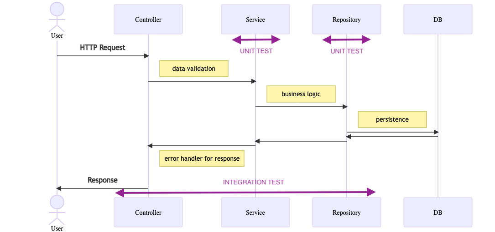

# SETTLE Backend

## Run Project with Docker.

On the root folder of the project run

```
docker-compose up -d --build
```
The server will be listening at 0.0.0.0:80

Documentation about the endpoints will be available at http://0.0.0.0/documentation/. 
Please, in order to populate the DB, use a first request  PATCH http://0.0.0.0/rates PostmanDockerCollection is provided to test these endpoints.


## Run project on local

The projects need a Mongo server to be running. Configuration can be pass through .env file (see env.example)

To run project 

```
npm start
```

The server will be listening at 127.0.0.1:3000

Documentation about the endpoints will be available at http://127.0.0.1:3000/documentation/. Please, in order to populate the DB, use a first request  PATCH http://127.0.0.1:3000/rates  PostmanLocalCollection is provided to test these endpoints. 

To run test

```
npm test
```

## Project Description

This project was built from scratch without any external boilerplate to keep a light structure. It was decided to follow a typical layer architecture, with three basic layer:
* Controllers: concentre the logic for recibe and response the HTTP request
* Services: Have the uses cases, and interact with the domains objects
* Repository: Responsible for data persistence. 
These layers were implemented as a single object and injected where needed via constructors.  I have decided to use this approach since I have been working recently with strongly typed, object oriented languages and I get used to this structure. Also this structure gives a simple way to test each component individually.
Adicionaly the projects have important objects:
* Domain objects: they are responsible for keeping all the business logic. I decided to implement domain exceptions to have control about the information the API passes to the user.
* Entities Objects: they are the representation of DB documents. Since I have decided to use mongoose, these objects also have the logic to save, update, etc.
I have written some units and integration tests. For times razons I decided to test only the getRate use case.



